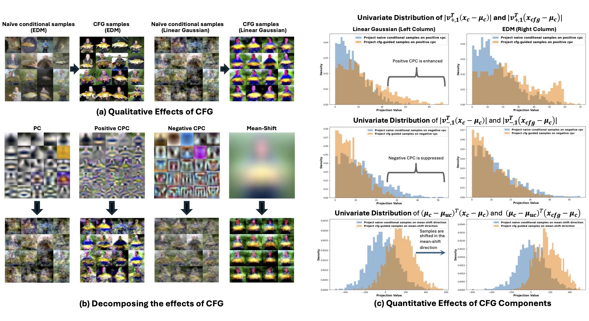

## Towards Understanding the Mechanisms of Classifier Free Guidance<br><sub>Official PyTorch implementation of the NeurIPS 2025 paper</sub>
**Towards Understanding the Mechanisms of Classifier Free Guidance**<br>
Xiang Li, Rongrong Wang, Qing Qu
<br>[https://arxiv.org/abs/2206.00364](https://arxiv.org/abs/2505.19210)<br>


## 1. Getting started

### 1) Clone the repository

### 2) Set environment

```
  - conda env create -f environment.yml -n edm
  - conda activate edm
```

### 3) Prepare essential files for running the experiments

1) Download the pre-computed covariance matrices for the 10 classes of Cifar-10 dataset from [Covariance_Cifar](https://drive.google.com/drive/folders/166r7Zjp0DCdPrJZFoLXdCrL3OGXjzv2q) and place the folder in the edm directory.
2) Download the pre-computed covariance matrices for 10 randomly selected classes of ImageNet dataset from [Covariance_ImageNetGenerated](https://drive.google.com/drive/folders/166r7Zjp0DCdPrJZFoLXdCrL3OGXjzv2q) and place the folder in the edm directory.
3) Download our pretrained unconditional ImageNet EDM model from [ImageNet_weights](https://drive.google.com/drive/folders/166r7Zjp0DCdPrJZFoLXdCrL3OGXjzv2q) and place the folder in the edm directory.

Refer to appendix C for details on how the empirical means and covariances are generated.
## 2. A initial look at Classifier-Free-Guidance (CFG)
In the notebook [A_Initial_Look_at_CFG.ipynb](edm/A_Initial_Look_at_CFG.ipynb), we demonstrate that 

1) standard (naive) conditional sampling yields subpar results,

2) CFG greatly enhances conditional generation, and

3) CFG achieves similar improvements in linear diffusion models, significantly boosting visual quality, enhacing the class-specific patterns.

## 3. Investigate CFG in Linear Diffusion Models
In the notebook [Investigate_CFG_in_Linear_Diffusion_Models.ipynb](edm/Investigate_CFG_in_Linear_Diffusion_Models.ipynb), we investigate the working mechanisms of CFG in linear diffusion models. We demonstrate that 

1) conditional linear diffusion models lack class-specificity becauase the inter-class covariance structures are not distinctive enough,

2) CFG improves generation quality by (i) enhancing positive contrastive principal components (CPCs), (ii) suppressing negative CPCs and (iii) pushing the samples towards the mean-shift direction.

## 4. Investigate CFG in Nonlinear Diffusion Models
Next, we study CFG's effect in real-world diffusion models in the linear regime (high noise levels) and nonlinear regime (low noise levels) separately. 
1) Firstly, in the notebook [Linear_to_Nonlinear_Transition_of_Diffusion_Models.ipynb](edm/Linear_to_Nonlinear_Transition_of_Diffusion_Models.ipynb), we demonstrate that diffusion models transition from a linear regime to a nonlinear
regime as the noise level decreases, where in the linear regime, the nonlinear diffusion models can be well approximated by the linear diffusion models. This linear-to-nonlinear transition motivates our separate analyses of CFG behavior in each regime.
2) Next, in the notebook [Investigate_CFG_in_Linear_Regime.ipynb](edm/Investigate_CFG_in_Linear_Regime.ipynb), we foucs on the linear regime, demonstrating that linear CFG leads to similar effecs as the nonlinear CFG.
3) Lastly, in the notebook [Investigate_CFG_in_Nonlinear_Regime.ipynb](edm/Investigate_CFG_in_Nonlinear_Regime.ipynb), we explore CFG in nonlinear regime based on the insights from linear analyses. Similar to the linear model case, we can still compute the CPCs from the posterior covariances. The differences are: (i) the posterior covariances in nonlinear regime can not be computed in closed form anymore, nevertheless, it is proportional to the denoiser's Jacobian, which can be computed via automatic differentiation, (ii) in linear model, posterior covariances do not depend on the specific samples, but in nonlinear models, the posterior covariances will be sample-dependent, i.e., the CPCs will adapt the geometry of the individual sample. We will show that a heuristic guidance built with positive CPC can lead to similar effects as those of the actual CFG in certain cases.

## 5. References
Our implementation is based on [EDM](https://github.com/NVlabs/edm).

## 6. Citation
If you find our work interesting or useful, please consider citing
```
@article{li2025towards,
  title={Towards Understanding the Mechanisms of Classifier-Free Guidance},
  author={Li, Xiang and Wang, Rongrong and Qu, Qing},
  journal={arXiv preprint arXiv:2505.19210},
  year={2025}
}
```
## 7. Contact

- Xiang Li, forkobe@umich.edu
